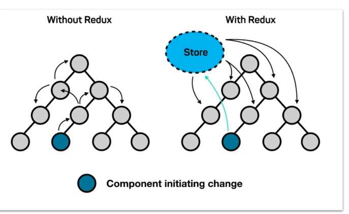

# react-jianshu

## 官方文档

 https://reactjs.org/

请读文档Docs ：https://reactjs.org/docs/getting-started.html

## 安装

~~~
初始化项目：create-react-app jianshu
cd jianshu
yarn start
~~~


## 基础

### jsx注释

~~~jsx
class Todo extends Component{
    render(){
        return(
        	<Fragment>
        		{/*这是一个注释*/}
        		<p>其它标签</p>
        	</Fragment>
        )
    }
}
~~~


### label  扩大对焦区域

~~~
<label htmlFor="inserArea">输入内容</label>
<input id="insertArea" />
~~~


### dangerouslySetInnerHTML

~~~
<li key={item} onClick={this.handleItemDelete.bind(this,index)}>
	dangerouslySetInnerHTML={{__html:item}}
</li>
~~~

避免出现html标签当作text格式的现象


### 插入单一标签替换div

~~~ jsx
import React, { Component,Fragment} from 'react;
class Todo extends Component{
    render(){
        return(
        	<Fragment>
        		<p>其它标签</p>
        	</Fragment>
        )
    }
}
~~~

Fragment作用为：替换原有的div作为根标签，不在页面显示出来 （React 16版本以后提供）


###  ServiceWorker的作用

Web离线应用解决方案——ServiceWorker：https://www.cnblogs.com/dojo-lzz/p/8047336.html

原入口文件index.js：

~~~jsx
import React from 'react';
import ReactDOM from 'react-dom';
import App from './App';
import * as serviceWorker from './serviceWorker';

ReactDOM.render(<App />, document.getElementById('root'));

serviceWorker.unregister();

~~~


###  组件基本介绍 

~~~
import React, { Component,Fragment} from 'react;
class Todo extends Component{
	constructor(prpos){
        super(props);
        this.state = {
            inputValue:"hello!!!",
            list:[]
        }
	}
    render(){
        return(
        	<Fragment>
        		<p>其它标签</p>
        	</Fragment>
        )
    }
}
~~~

+ Todo 类是继承Component，所以它的父类是Component
+ 类下会有一个构造函数，进入类首先会执行构造函数，它里面的参数props是继承于父类的
+ react的数据是要存入在state里面


### React中的响应式设计思想和事件绑定

~~~jsx
import React, { Component,Fragment} from 'react'
class Todo extends Component{
	constructor(props){
        super(props);
        this.state = {
            inputValue:"hello!!!",
        }
	}
    render(){
        return(
        	<Fragment>
        		<div>
        			<input value={this.state.inputValue}
                    onChange={this.hadleInputChange.bind(this)}/>
              <button>提交</button>
        		</div>
        	</Fragment>
        )
    }
    hadleInputChange(e){
        console.log(e.target)
        this.setState({
            inputValue:e.target.value
        })
    }
}
export default Todo;
~~~

- .bind(this)的使用

~~~
1 在hadleInputChange不是箭头函数的时候：
	this.hadleInputChange.bind(this)    ---->  .bind(this) 是绑定当前组件的this
2 当hadleInputChange是箭头的时候，不需要.bind(this)
	this.hadleInputChange
~~~

- 组件的state里的值必须是通过react封装好的函数来改变

  ~~~jsx
      hadleInputChange(e){
          console.log(e.target)
          this.setState({
              inputValue:e.target.value
          })
      }
  ~~~

  

### 列表循环与.map方法

~~~jsx
class Todo extends Component{
	constructor(props){
        super(props);
        this.state = {
            list:["hello!!!","hi react"],
        }
	}
    render(){
        return(
        	<Fragment>
				<ul>
					{
                        this.state.list.map((item,index)=>{
                            return <li>{item}</li>
                        })
					}
				</ul>
        	</Fragment>
        )
    }
}
~~~

map方法是对数据的一个循环遍历，里面可以有两个参数,item和index,如示例就会生成：

~~~html
<ul>
    <li>hello!!!</li>
    <li>hi react</li>
</ul>
~~~


### 展开运算符 ...list

~~~
list:["hello!!!","hi react"],
handleBtnClick(){
    this.setState({
        list:[...this.state.list,this.state.inputValue]
    })
}
~~~

这个是将原有的list展开后，和inputValue组成新的数组


### 删除 index下标

~~~jsx
{
    this.state.list.map((item,index)=>{
        return(
            <li key={item} onClick={this.handleItemDelete.bind(this,index)}>
            	{item}
            </li>
        )
    })
}

handleItemDelete(index){
    const list = [...this.state.list];
    list.splice(index,1);
    this.setState({
        list:list
    })
}
~~~

删除操作的是数据，不操作dom,所以我们要改变的是state里面的数据


### 数组操作

1 备份list数组：

~~~
const list = [...this.state.list]
~~~

2 删除下标为index的1个数

~~~
list.splice(index,1)
~~~

3 数组循环，通过map方法  

可参考上面的map方法示例，下面例子抄自菜鸟

~~~
返回一个数组，数组中元素为原始数组的平方根:

var numbers = [4, 9, 16, 25];

function myFunction() {
    x = document.getElementById("demo")
    x.innerHTML = numbers.map(Math.sqrt);
}
输出结果为:

2,3,4,5
~~~


### setState 多种写法

#### 1 immutable

react 中有个immutable,它不允许我们修改state，如果非要修改，可以通过setState函数来改变，而不是直接this.state.list = xxx;

例如正确的示例：

~~~jsx
handleItemDelete(index){
    const list = [...this.state.list];
    list.splice(index,1);
    //this.state.list.splice(index,1) 这样子不合理
    this.setState({
        list:list
    })
}
~~~


#### 2 异步setState

~~~jsx
handleInputChange(e){
    const value = e.target.value;
    this.setState(()=>{
        inputValue:value,
        //inputValue:e.target.value,   这样子会报错，需要在外面先赋值好
    })
}
~~~

#### 3 异步setState的参数：prevSstate

setState变为异步函数后，它有个参数prevSstate为未修改state前的值

~~~jsx
list:["hello!!!","hi react"],
handleBtnClick(){
    this.setState({
        list:[...this.state.list,this.state.inputValue]
    })
}
上面的相当于下面的
handleBtnClick(){
    this.setState((prevState)=>({
        list:[...prevState.list,prevState.inputValue]
    }))
}
~~~

#### 4 异步setState加了return后

~~~jsx
handleItemDelete(index){
    const list = [...this.state.list];
    list.splice(index,1);
    this.setState({
        list:list
    })
}
相当于下面的：
handleItemDelete(index){
    this.setState((prevState)=>{
    	const list = [...prevState.list];
    	list.splice(index,1);
        return {list}
    })
}
~~~


### 组件间的传值

#### 父向子传值 

通过属性方式

09


#### 子向父传值

14

子组件调用父组件的方法来修改父组件的内容

因为是调用父组件的方法，所以在子组件里执行传过来的函数会相当于在父组件里面执行它的函数一样，但父组件传值过来需要通过.bind(this)来绑定它的this组件

删除子组件


## react 基础进阶

### 自行安装 react插件

安装后可以看到react代码及各组件中的值 等


### PropTypes 与DefaultProps


~~~
import propTypes from 'prop-type'     对属性作检验，脚手架自带

const propTypes = {
  value: PropTypes.oneOfType([PropTypes.string, PropTypes.number]),
  className: PropTypes.string,
  size: PropTypes.oneOf(['sm', 'lg']),
  onChange: PropTypes.func,
  options: PropTypes.oneOfType([PropTypes.array, PropTypes.object]),
  style: PropTypes.object,
  role: PropTypes.oneOf(['switch']),
  minWidth: PropTypes.string,
  disabled: PropTypes.any,
  readOnly: PropTypes.any,
};

const defaultProps = {
  role: 'switch',
  disabled: false,
  readOnly: false,
};

~~~


###  props,state与render函数的关系

当组件的state或props发生改变的时候，render函数就会重新执行，

当然子组件的render也会执行。


### 虚拟DOM


### react 中ref的使用


### setState中的异步请求

~~~jsx
handleBtnClick(){
    this.setState((prevState)=>({
        list:[...prevState.list,prevState.inputValue],
    }),()=>{
        console.log(this.ul.querySelectorAll('div').length); //  1
    })
    console.log(this.ul.querySelectorAll('div').length);  //0
}

~~~

setState是一个异步函数，所以如果你需要操作dom，setState提供一个参数,用于异步请求完成的时候执行。


### 生命周期函数


生命周期函数指在某一个时刻组件会自动调用执行的函数

每个组件都会有生命周期函数 

挂载：

componentWillMount

在组件即将挂载到页面的时候执行 


render页面挂载的时候执行


componentDidMount

页面被挂载完成后执行，


更新：

数据发生变化 的时候， props或states


componentWillReceiveProps

当一个组件从父组件接收参数

只要父组件的render函数被重新执行（重新渲染）了，子组件的这个生命周期函数就会被执行

接收props，并且props被改变后才会执行


shouldComponentUpdate , 要求返回bool类型

组件被更新之前，会自动执行，为true,组件需要被更新， 为false ,组件不会被更新


componentWillUpdate

组件被更新之前，它会自动执行，但是他在shouldComponentUpdate之后执行

如果shouldComponentUpdate返回true才执行，返回false则不会执行


render


componentDidUpdate

组件更新完后会被更新


componentWillUnmount

当这个组件即将被从页面中剔除的时候会被执行


### 生命周期函数使用场景

1 性能优化

~~~
shouldComponentUpdate(nextProps,nextState){
    if(nextProps.content !== this.props.content){
        return true;
    }else{
        reutrn false;
    }
}
~~~

在接收到组件的props发生变化时，是否需要改变，提高性能


提高性能的还有：

constructor

setState异步请求(加参数)


2 发送ajax请求

~~~
componentDidMount(){
    axios.get('/api/todolist')
    	.then((res)=>{
            //console.log(res.data);
            this.setState(()=>({
                list:[...res.data]
            }));
    	})
    	.catch(()=>{alert('error')})
}
~~~

一般在componentDidMount里发送异步请求， 

setState写在匿名函数的比较好


### 使用Charles进行本地接口数据模拟

其实跟mock差不多，这个Charles要进行安装 ，不作介绍 

https://www.easy-mock.com/

## redux

redux = reducer + flux




### 安装浏览器扩展程序：redux devtools

在代码里添加下面这一句启动redux-devtools

```
 const store = createStore(
   reducer, /* preloadedState, */
+  window.__REDUX_DEVTOOLS_EXTENSION__ && window.__REDUX_DEVTOOLS_EXTENSION__()
 );
```


### redux工作流程


```
yarn add redux
```

store/index.js   创建store

~~~jsx
import {createStore} from 'redux';
import reducer from './reducer';
const store = createStore(
    reducer,
    window.__REDUX_DEVTOOLS_EXTENSION__ && window.__REDUX_DEVTOOLS_EXTENSION__(),
);

export default store;

~~~


store/reducer.js 创建reducer

~~~jsx
const defaultState = {
    inputValue:'abc',
    list:[1,2],
}
export default (state = defaultState,action)=>{
    //state为之前的数据，action为得到当前收到的动作
    console.log(state,action)
    return state;
}
~~~

组件 TodoList.js       将store的state赋值给组件的state

~~~jsx
import store from './store'
class TodoList extends Component{
    constructor(props){
        super(props);
        this.state = store.getState()
    }
    ...
}
~~~


在组件中用dispatch发送一个action:

~~~jsx
    handleInputChange=(e)=>{
        //console.log(e.target.value)
        const action = {
            type:'change_input_value',
            value:e.target.value
        }
        store.dispatch(action);
    }
~~~

store收到action会自动地将action转发给reducer,

reducer对收到的动作做进一步的处理，处理完后会返回给store，替换掉旧数据

reducer.js

~~~jsx
const defaultState = {
    inputValue:'abc',
    list:[1,2],
}

export default (state = defaultState,action)=>{
    //state为之前的数据，action为得到当前收到的动作
    //console.log(state,action)
    if(action.type === 'change_input_value'){
        const newState = JSON.parse(JSON.stringify(state));
        newState.inputValue = action.value;
        return newState;
    }
    return state;
}
~~~


在组件中写一个订阅函数，只要store中的state数据发生改变就会执行这个订阅函数

在store发生变化后，将store的数据更新到组件的数据中

TodoList.js

~~~jsx
class TodoList extends Component{
    constructor(props){
        super(props);
        this.state = store.getState()
        store.subscribe(this.handleStoreChange);
    }
    handleStoreChange=()=>{
        this.setState(store.getState())
    }
}
~~~

小总结 ：

reducer 可以接受state,但是绝不能修改state

reducer必须是纯函数，纯函数指的是，给定固定的输入，就一定会有固定的输出，而且不会有任何副作用（不能有定时，回调，等）


redux的核心API：

~~~
createStore
store.dispatch
store.getState
store.subscribe
~~~


## redux发送异步请求获取数据


### redux-thunk

用来将ajax请求放在action里面

~~~

~~~


